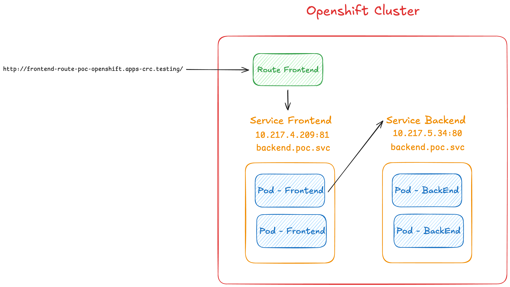

# OpenShift POC (Proof of Concept)

This repository contains a simple proof of concept for running two containerized applications (a **front-end** and a **back-end**) on an [OpenShift](https://www.openshift.com/) cluster. The project was created to learn the basics of OpenShift using a local cluster provided by [CodeReady Containers (CRC)](https://developers.redhat.com/products/codeready-containers/overview).

## Table of Contents

- [Overview](#overview)
- [Architecture](#architecture)
- [Project Structure](#project-structure)
- [Prerequisites](#prerequisites)
- [Getting Started](#getting-started)
  - [1. Set Up the CRC Cluster](#1-set-up-the-crc-cluster)
  - [2. Deploy to OpenShift](#2-deploy-to-openshift)
- [Cheat Sheets](#cheat-sheets)
  - [CRC Commands](#crc-commands)
  - [OC Commands](#oc-commands)
- [License](#license)
- [Acknowledgments](#acknowledgments)

---

## Overview

This project demonstrates how to:

1. Build and containerize two simple Python applications (front-end and back-end).
2. Deploy these containers to an OpenShift cluster.
3. Expose them via **Services** and **Routes** so they can communicate internally (front-end to back-end) and externally (via a browser).

## Architecture

Below is a high-level architecture diagram illustrating how the **front-end** and **back-end** applications are deployed in OpenShift:




The **front-end** application makes requests to the **back-end** application through the backend service. Both services can be exposed externally via OpenShift Routes.

## Project Structure

```
project-root/
│
├── openshift/
│   ├── backend-deployment.yaml
│   ├── backend-route.yaml
│   ├── backend-service.yaml
│   ├── frontend-deployment.yaml
│   ├── frontend-route.yaml
│   └── frontend-service.yaml
│
├── backend/
│   ├── app.py
│   ├── Dockerfile
│   └── requirements.txt
│
├── frontend/
│   ├── app.py
│   ├── Dockerfile
│   └── requirements.txt
│
└── README.md
```